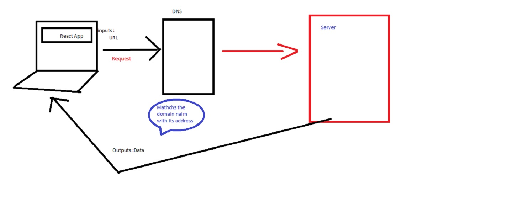
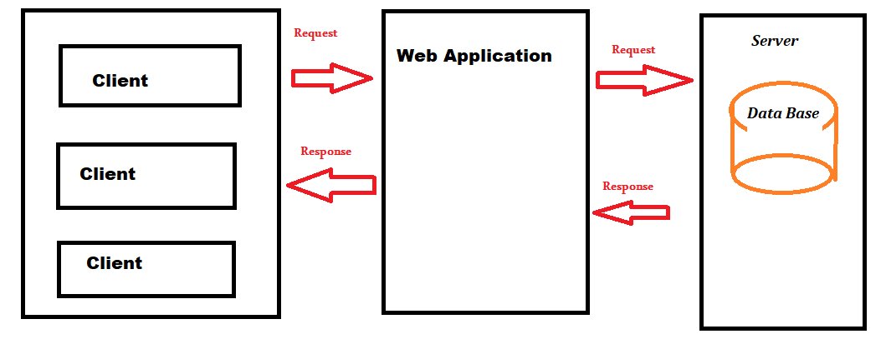
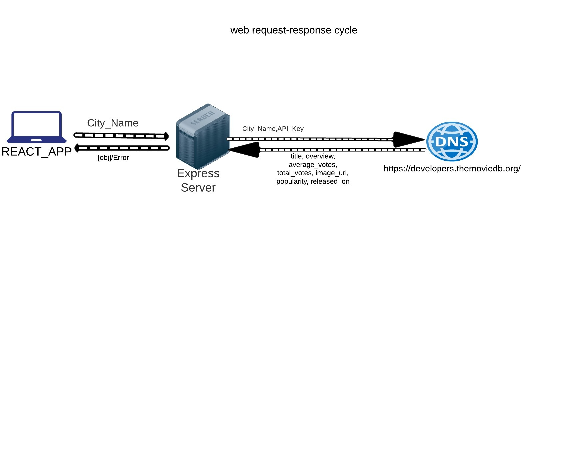

# City Explorer 

**Author**: Mariam AlOwdat
**Version**: 1.0.0 
<!-- (increment the patch/fix version number if you make more commits past your first submission) -->

## Overview
I will build a React application that uses the Axios library to make user-initiated reqeusts for data from a thrid-party API.

## Architecture
we're using React.JS as the language of programming however we use the React-bootstrap library to style the website and the Axios library to connect the website with the server as well .
## Change Log
<!-- Use this area to document the iterative changes made to your application as each feature is successfully implemented. Use time stamps. Here's an example:

01-01-2001 4:59pm - Application now has a fully-functional express server, with a GET route for the location resource. -->
* Created a new repo called city-explorer on GitHub, initialized with no files.
* Add a .gitignore file with React configurations.
* Used create-react-app to setup a new React application named city-explorer in My local projects directory.
*  Connectd my GitHub repo to my local repo using the directions on GitHub.
* Created a package.json file with all dependencies and any associated details related to configuration. includes: Axios and Bootstrap. 
*  Procure a LocationIQ free-tier account. From the Dashboard, navigate to your API Access Tokens page. View, then Update the existing token, to change the label to "City Explorer"

## Credit and Collaborations
<!-- Give credit (and a link) to other people or resources that helped you build this application. -->

* https://www.youtube.com/watch?v=sfp5K_5GHNg
* LocationIO for the free API 

# lab o6 

Name of feature: Set up your React repository & API keys.

Estimate of time needed to complete: 15 mins

Start time: 5pm  

Finish time: 5:15 pm 

Actual time needed to complete: 2 hours 
 

Name of feature: ocations: As a user of City Explorer, I want to enter the name of a location so that I can see the exact latitude and longitude of that location.

Estimate of time needed to complete: 1 hour 

Start time: __10 pm___

Finish time: __11 pm ___

Actual time needed to complete: __1 hour ___

Name of feature:Map: As a user, I want to see a map of the city so that I can see the layout of the area I want to explore. 

Estimate of time needed to complete: __30 mins___

Start time: ___11:30 pm __

Finish time: __12 pm ___

Actual time needed to complete: 40 mins 

Name of feature: Errors: As a user, I want clear messages if something goes wrong so I know if I need to make any changes or try again in a different manner.

Estimate of time needed to complete: __30 mins ___

Start time: ___12:30 am__

Finish time: __1:00__am_

Actual time needed to complete: _30 mins____

# class 07 

# Project Name

**Author**: mariam 
**Version**: 1.0.0 

## Overview
I will begin building MY own custom API server, which will provide data for the City Explorer front-end application. This means users will get to see not only the map, but also interesting information about the area, provided by a variety of third-party APIs that MY server will manage.

## Getting Started
SEARCH ABOUT THE NAME OF THE CITY.ONCE THE SUBMITS THRE FORM , THE DATSA WILL  BE RENDERED FROM THER SERVER.

## Architecture
* Send the full array back to the client who requested data from the weather endpoinT.
* When the server returns the array of forecast data, show the Weather component, populated with the server data.
* Use appropriate Bootstrap components to nicely display the forecast data. 

Name of feature: Weather (placeholder): As a user of City Explorer, I want to see weather info for the city I searched, so that I know how to pack for an upcoming trip.

Estimate of time needed to complete: ___4hours__

Start time: ___5pm __

Finish time: __9pm___

Actual time needed to complete: __4 hours ___

# lab 08 

<!-- # Getting Started with Create React App

This project was bootstrapped with [Create React App](https://github.com/facebook/create-react-app).

## Available Scripts

In the project directory, you can run:

### `npm start`

Runs the app in the development mode.\
Open [http://localhost:3000](http://localhost:3000) to view it in the browser.

The page will reload if you make edits.\
You will also see any lint errors in the console.

### `npm test`

Launches the test runner in the interactive watch mode.\
See the section about [running tests](https://facebook.github.io/create-react-app/docs/running-tests) for more information.

### `npm run build`

Builds the app for production to the `build` folder.\
It correctly bundles React in production mode and optimizes the build for the best performance.

The build is minified and the filenames include the hashes.\
Your app is ready to be deployed!

See the section about [deployment](https://facebook.github.io/create-react-app/docs/deployment) for more information.

### `npm run eject`

**Note: this is a one-way operation. Once you `eject`, you can’t go back!**

If you aren’t satisfied with the build tool and configuration choices, you can `eject` at any time. This command will remove the single build dependency from your project.

Instead, it will copy all the configuration files and the transitive dependencies (webpack, Babel, ESLint, etc) right into your project so you have full control over them. All of the commands except `eject` will still work, but they will point to the copied scripts so you can tweak them. At this point you’re on your own.

You don’t have to ever use `eject`. The curated feature set is suitable for small and middle deployments, and you shouldn’t feel obligated to use this feature. However we understand that this tool wouldn’t be useful if you couldn’t customize it when you are ready for it.

## Learn More

You can learn more in the [Create React App documentation](https://facebook.github.io/create-react-app/docs/getting-started).

To learn React, check out the [React documentation](https://reactjs.org/).

### Code Splitting

This section has moved here: [https://facebook.github.io/create-react-app/docs/code-splitting](https://facebook.github.io/create-react-app/docs/code-splitting)

### Analyzing the Bundle Size

This section has moved here: [https://facebook.github.io/create-react-app/docs/analyzing-the-bundle-size](https://facebook.github.io/create-react-app/docs/analyzing-the-bundle-size)

### Making a Progressive Web App

This section has moved here: [https://facebook.github.io/create-react-app/docs/making-a-progressive-web-app](https://facebook.github.io/create-react-app/docs/making-a-progressive-web-app)

### Advanced Configuration

This section has moved here: [https://facebook.github.io/create-react-app/docs/advanced-configuration](https://facebook.github.io/create-react-app/docs/advanced-configuration)

### Deployment

This section has moved here: [https://facebook.github.io/create-react-app/docs/deployment](https://facebook.github.io/create-react-app/docs/deployment)

### `npm run build` fails to minify

This section has moved here: [https://facebook.github.io/create-react-app/docs/troubleshooting#npm-run-build-fails-to-minify](https://facebook.github.io/create-react-app/docs/troubleshooting#npm-run-build-fails-to-minify) -->
